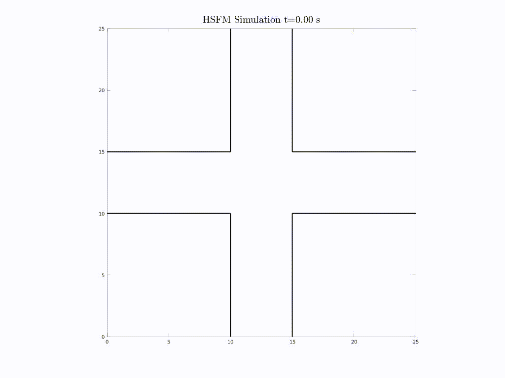
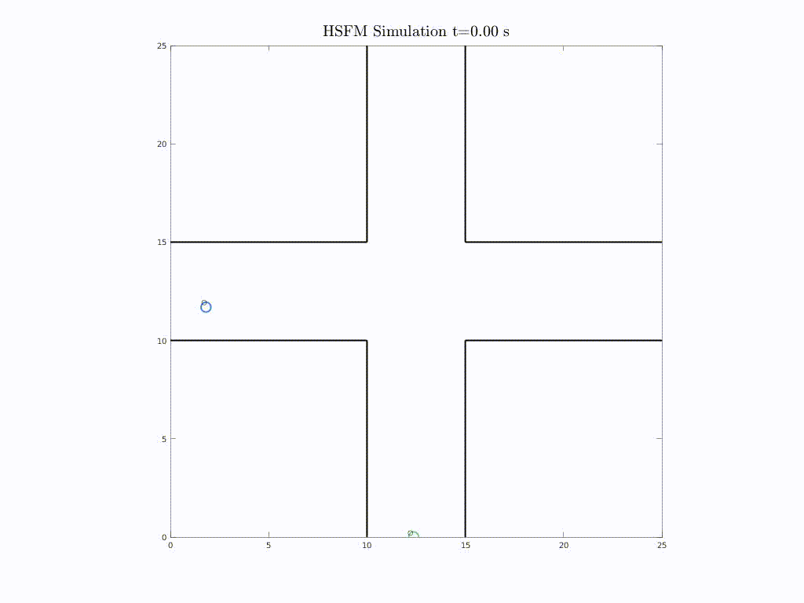
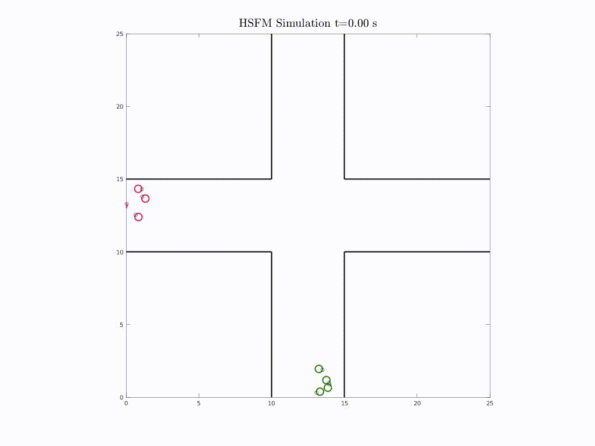

# PedDynSim
A simulation of pedestrian dynamics in an intersecting corridor environment with different values of flux and pedestrian group size, using a Headed Social Force Model (HSFM).

## Objective
Simulate the pedestrian flow in  the following geometry representing two intersecting corridors with walls, with a constant flux in the AB and CD directions. Representation of individual pedestrians in simulation is necessary. Perform the simulation with at least four different pedestrian flux values in the range $\phi = 0.2 - 2$ pedestrians/second, taking into account the desired target path/exit and velocity, as well as the avoidance of other pedestrians.

## Assumptions
For the representation of the pedestrians, assume that:
* They have a circular cross-section with radius r=0.25m
* They have a desired velocity in the range of 1.1-1.3 m/sec
* Their maximum acceleration is 2 m/sec^2
* Integrate the motion of the pedestrians for 60 sec

## Model
A Social Force Model (SFM) is used to simulate the pedestrian flow. The main assumptions of SFMs are that the temporal changes of a pedestrian's preferred velocity and path can be described as a sum of 'social forces' that represents the effect of the environment (other pedestrians and obstacles) on their behaviour. As such, the pedestrian's trajectory can be modelled using a system of nonlinear ordinary differential equations (Helbing & Molnaar, 1995). For this simulation, we implement the Headed Social Force Model (HSFM) developed by Farina et. al. (2017). In a traditional SFM, a pedestrian is able to move in any direction at all times. In the HSFM the pedestrians' velocity vectors are aligned with their heading, based on empirical evidence that humans have a tendency to move forward. The subsequent body rotations are generated by the lateral component of the force in charge of driving the pedestrian towards the goal, and implies that a person will turn faster towards an attractive target (e.g. the destination). The HSFM also introduces an additional force in order to reproduce the behavior of people intentionally walking together as a single group, which is designed to drive individuals back into the group region whenever they leave it. 

## Numerical Simulation
The numerical implementation is adapted for the current geometry from the methodology and algorithm developed by Farina et. al. (2017). To simulate a constant flux of pedestrians in the ABCD region, pedestrians are initialised at $t=0$ at equidistant points outside the regions A and C, such that the desired flux is maintained as they enter and leave the corridors. Values of $\phi \in [0.2, 0.5, 1, 2]$ are used. The simulations are conducted for two scenarios:
* Individual pedestrians entering the region with flux $\phi$.
* Groups entering the region with group flux $\phi$.

### Individuals

* We assign a random orientation for the initial heading, and random desired velocity within the range $[1.1 1.3]$ to each pedestrian. 
* A starting zone is created around the provided initial coordinate, of adjustable amplitude. The starting position of the pedestrian is then randomised within this zone. This provides a more realistic scenario for pedestrians walking along a corridor than in an exact single file. 
* To restrict the acceleration to a maximum of $2 m/s^2$, the parameter $\tau$ is adjusted. In the SFM, $\tau$ represents the relaxation time, in which the actual velocity can approach the desired velocity.
* A waypoint sequence of points is provided for each pedestrian, consisting of coordinates they are required to pass through.
* To include the pedestrians' heading into the model, a body frame  is attached to each individual, i.e. a reference
frame centered at the pedestrian's position and whose x-axis is aligned with the pedestrian's forward direction of motion. This is represented in the animations by a small black circle on each pedestrian. 

Simulation results for the four different values of $\phi$ are shown in the animations below.

$\phi =\frac{1}{5}$            |   $\phi = \frac{1}{2} $
:-------------------------:|:-------------------------:
  |  

For $\phi = 0.2$, we note that while the pedestrians are able to navigate between other pedestrians and walls, different starting positions in the 'starting zone' and external influences before they enter the corridor cause deviations from desired velocity, and subsequently cause slight perturbations in the flux at which they enter the corridor. At an increased flux of 1 pedestrian every 2 seconds the simulation shows the model performs quite well, and all pedestrians are able to effectively navigate towards their desired exit point.

$\phi =\frac{1}{1}$            |   $\phi = \frac{1}{0.5} $
:-------------------------:|:-------------------------:
  |  

For $\phi =1$ and $\phi =2$, we see that the increased crowding at the intersection leads to some pedestrians being 'stuck' against the walls and unable to reach their desired exit in both simulations. Additionally, at $t\approx 30s$ we note there is some crowding around some focal points at the intersection. This may be  due to the points $(13,10)$ and $(10, 12)$ being initialised as waypoints (points along the path the pedestrians are required to pass through) for the AB and CD paths respectively. These points were arbitrarily provided as halfway marks along the desired path, but due to the high density of pedestrians could be an impediment to the pedestrians unable to reach the point. 

### Groups

We repeat the simulations for the four different values of $\phi$, but this time with groups of pedestrians instead of individuals. Here $\phi$ represents the flux of the group. Additionally, we adjust the waypoints $(13,10)$ and $(10, 12)$ for AB and CD respectively to $(13,20)$ and $(20, 12)$ to avoid crowding at the intersection. 

$\phi =\frac{2}{10}$            |   $\phi = \frac{5}{10} $
:-------------------------:|:-------------------------:
  |  

$\phi =\frac{5}{5}$            |   $\phi = \frac{6}{3} $
:-------------------------:|:-------------------------:
  |  

We see that adjusting the waypoint sequence has solved the crowding and 'stuck' pedestrian issue. There is still some crowding for $\phi = 2$, however, that is to be expected given the density within the given geometry. 

## Future Considerations
Improvements in the model can be made based on the key performance indicators. These can include
* Minimising the time between entry and exit along the desired path AB or CD for different values of $\phi$.
* Evaluating the model with different flux values along the two corridors.
* Optimizing the waypoint sequence analytically for the pedestrians instead of arbitrarily choosing.
* Evaluating the sensitivity to the "forward heading" parameters, in order to improve trajectory of "stuck" pedestrians
* Evaluating sensitivity to the group force parameters, which control the formation of the group (single line, or spread out laterally)
* __Once prototype of solver is complete, export to C++ or Python for wider array of data analysis and high performance computing.__

## References
1. Helbing D, Molnaar P., Social force model for pedestrian dynamics (1995), Phys Rev E., 51:4282-4286, doi: 10.1103/PhysRevE.51.4282
2. Farina F, Fontanelli D, Garulli A, Giannitrapani A, Prattichizzo D (2017), Walking Ahead: The Headed Social Force Model. PLoS ONE, 12(1): e0169734, doi:10.1371/journal.pone.0169734

## Code

The simulation is created by executing the matlab script __simulation_run.m__ . The flux variables and other parameter settings can be adjusted in this script. The relevant case files are automatically saved using the identifier __case_num__. The video of the simulation can be generated using the __movieplay.m__ script. All results displayed here are found in the __results__ directory, and the following table describes each data file.

| Case Number  | Description                 |
|--------------|-----------------------------|
|  01            |        $\phi = \frac{1}{5}$|                     |
|  02           |        $\phi = \frac{1}{0.5}$                      |
|  03          |           $\phi = \frac{1}{1} $                  |
|  04           |     $\phi = \frac{1}{2}$                         |
|  05           |            $\phi = \frac{2}{10}$, group, waypoint sequence adjusted                  |
|  06           |       $\phi = \frac{6}{3}$, group, waypoint sequence adjusted                        |
|  07           |             $\phi = \frac{5}{5}$, group, waypoint sequence adjusted                   |
|  08           |       $\phi = \frac{5}{10}$, group, waypoint sequence adjusted               |

